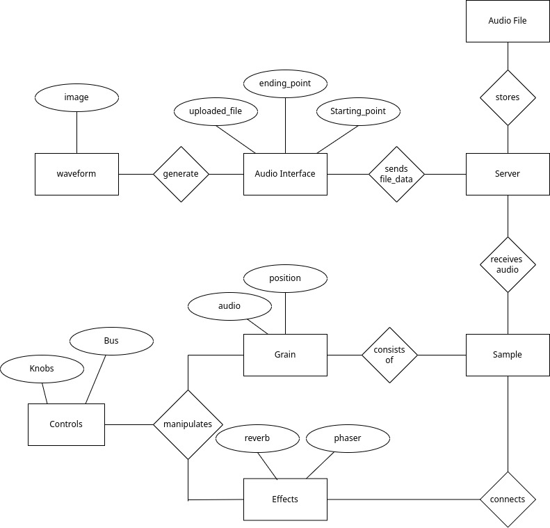
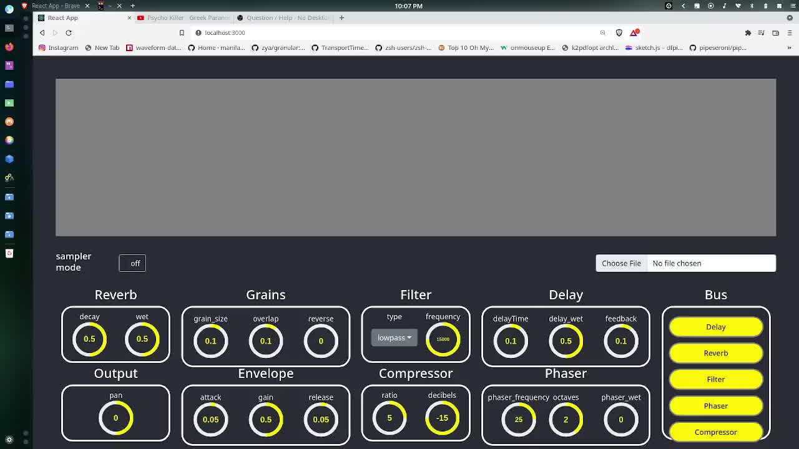

#Web Granular Synthesizer 

## Introduction
### What is it?
The Granular synthesizer is a tool that helps us create complex and 
experimental sounds.
It receives an audio file as input and chops it into bits and pieces.
Those parts are called grains the process of manipulation of them is named 
Granular synthesis
### Effects
To help the user shape the sound better I have added a series of effects to help
the user in the sound creation process. In particular, the following are
available :
* Reverb
* Ping-pong Delay
* Phaser
* Compressor
I also implemented a drag and drop list as a bus to determine the order into which
the effects will be applied.

## How was it made
The app follows a client-server architecture. Specifically the server-side
has been built with **Nodejs** and **Express** and the front end with **React**.
### Logic
The application follows the logic below

## Demo

## Instalation
If you want to try it for yourself clone the repo and run
`npm i; yarn`
for each the api and frontend folders 
after run 
`cd api; 
node ./bin/www` 
to start the server
and 
`cd frontend ;
npm start` to start react
## Links
More info in the [presentation](./presentation.pdf)

